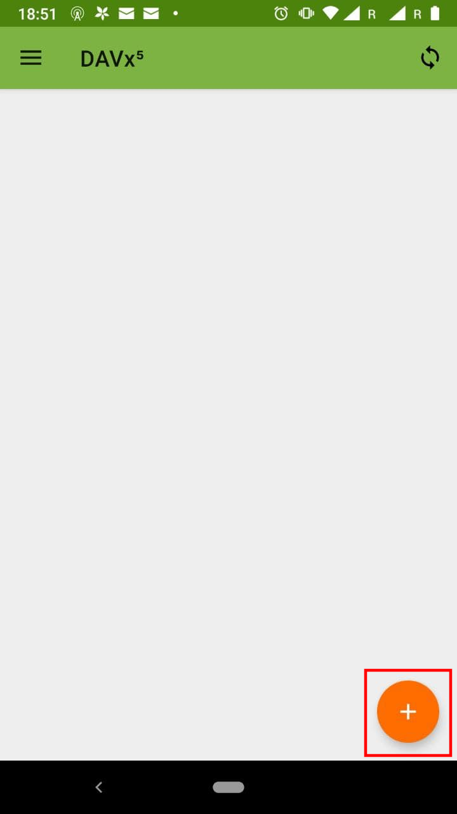
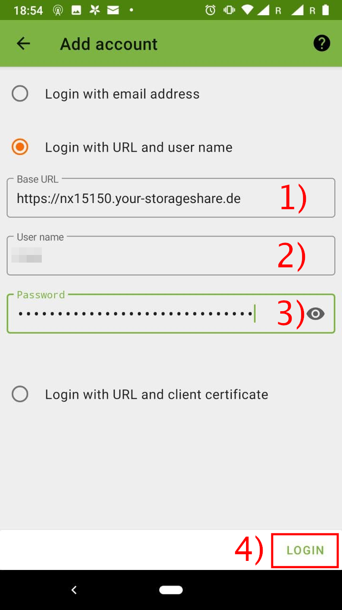
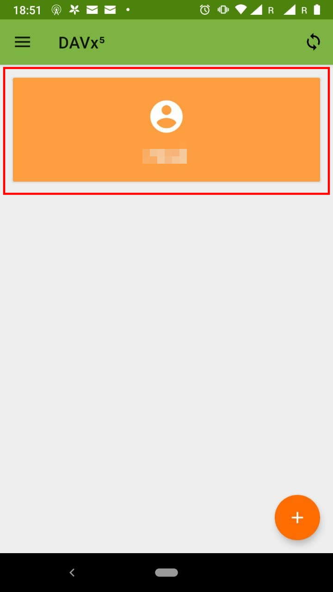
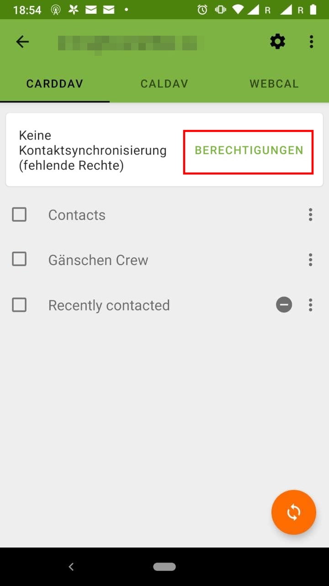

# Kontakte und Kalender synchronisieren

Um Kalender und Kontakte synchronisieren zu können, muss die Applikation DAVx5 vom [Google Playstore](https://play.google.com/store/apps/details?id=at.bitfire.davdroid) heruntergeladen und installiert werden. Die Entwickler.innen haben sich entschieden, in kommerziellen Marktplätzen Geld für die App zu verlangen. Personen, welche sich das nicht leisten können/wollen, haben die Möglichkeit, DAVx5 kostenlos über den freien Store F-Droid [zu beziehen](https://f-droid.org/en/packages/at.bitfire.davdroid/). Weitere Informationen über die Benutzung von F-Droid finden sich [im entsprechenden Abschnitt](/clients/android/fdroid/index.html) dieser Dokumentation.

Öffne die App und klicke dich durch die Begrüßung mit Klicks auf den Pfeil-Button.

Bestätige den Hinweis mit einem Klick auf den Button.

Klicke auf den Plus-Button, um mit dem Hinzufügen eines neuen Accounts zu beginnen.

Wähle nun die Loginoption URL + Benutzername aus.

Nun können die relevanten Daten eingetragen werden. Trage zunächst (1) die URL der Cloud (in diesem Falle `https://nx15150.your-storageshare.de`), danach (2) deinen Benutzername und abschließend (3) dein Passwort ein. Danach kannst du mit einem Tippen auf »Anmelden« den Prozess starten.

War die Anmeldung erfolgreich, ist folgende Ansicht zu sehen. Es empfiehlt sich, die vorgeschlagenen Einstellungen zu übernehmen und mit einem Tippen auf »Konto anlegen« die Anmeldung abzuschließen.

Im Anschluss daran öffnet sich die Hauptansicht der App. Um die Kalender und Kontaktbücher zu verwalten, klicke auf den neu angelegten Account.

Zunächst muss der Applikation Berechtigungen zugeteilt werden. Hierfür auf »Berechtigungen« tippen.

Nun alle Berechtigungen zulassen, indem auf die Schaltfläche neben »Alles Darunter« aktiviert wird. Es werden nun zwei Dialoge aufgehen, in welchen die Berechtigung für die Kontakte als auch die Kalender bestätigt werden müssen.

Wurde allen Dialogen zugestimmt, so sind alle drei Schalter nun aktiviert. Kehre mit einem Klicken auf den Zurückpfeil wieder zu den Kontaktbücher zurück.

In dieser Ansicht (»Carddav«) können die Kontaktbücher ausgewählt werden, welche mit dem Smartphone synchronisiert werden sollen. Danach auf den Reiter »Caldav« tippen (2), um die Kalender auszuwählen.

In der Kalenderansicht die gewünschten Kalender auswählen. Danach sollte eine initiale Synchronisation mit dem Sync-Button (2) gestartet werden.

Die Kalender und Kontaktbücher sind nun auf deinem Smartphone eingerichtet und können in den entsprechenden Apps (Kalender, Kontakte) verwendet werden. Die Synchronisation geschieht hierbei automatisch.

