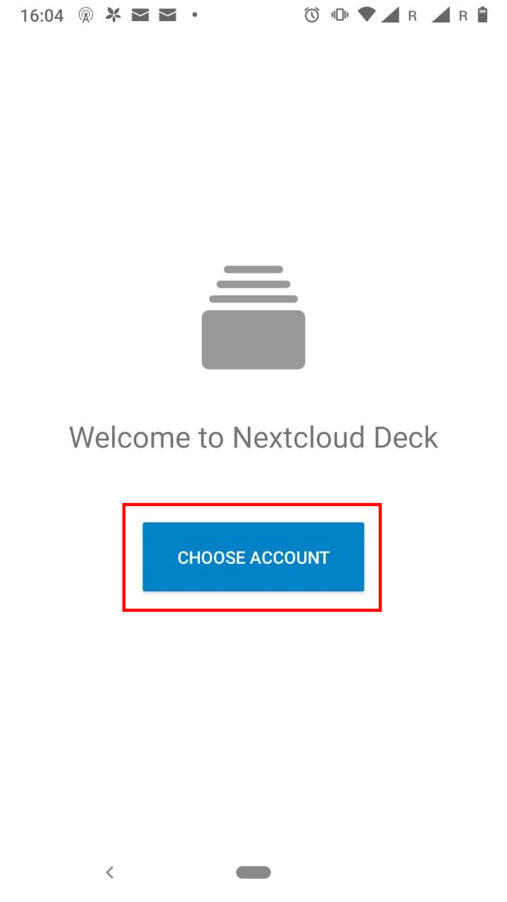
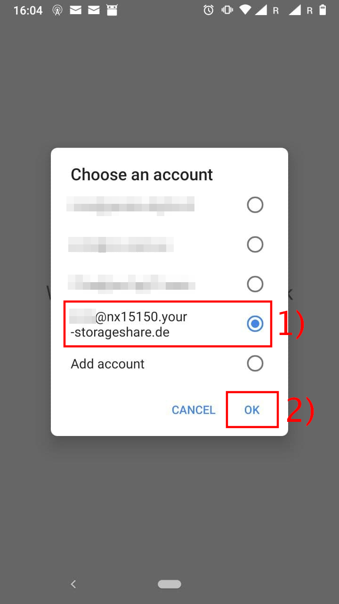
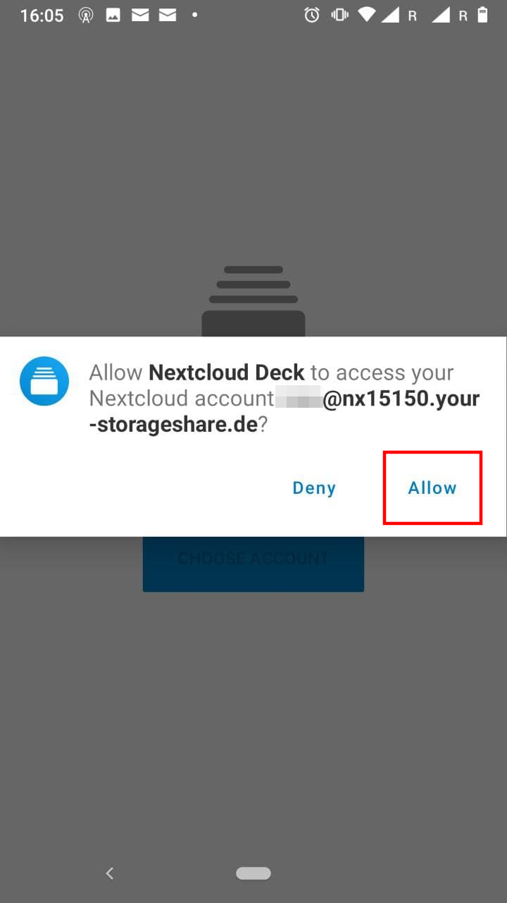
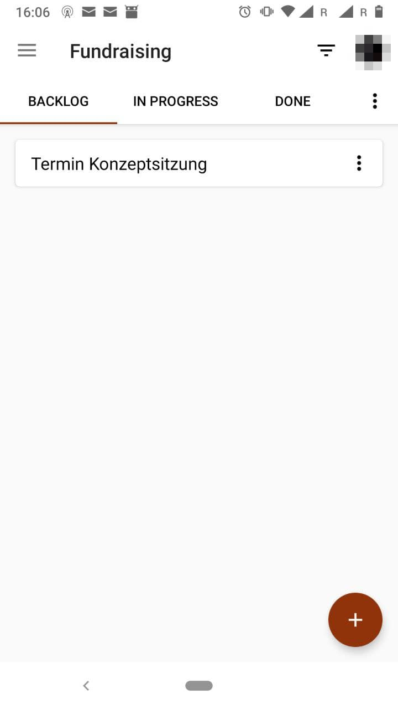

# Deck

Für die Inhalte der Deck Applikation können existiert eine eigene App für die Android Plattform. Neben einer auf Smartphones angepassten Übersicht, werden dir auch Notifications über deine Tasks geschickt. Die Entwickler.innen haben sich entschieden, in kommerziellen Marktplätzen Geld für die App zu verlangen. Personen, welche sich das nicht leisten können/wollen, haben die Möglichkeit, die Deck App kostenlos über den freien Store F-Droid [zu beziehen](https://f-droid.org/en/packages/at.bitfire.davdroid/). Weitere Informationen über die Benutzung von F-Droid finden sich [im entsprechenden Abschnitt](/clients/android/fdroid/index.html) dieser Dokumentation.

Die Konfiguration der Deck Applikation ist am einfachsten, wenn du bereits die normale Nextcloud App heruntergeladen und konfiguriert hast. Weitere Informationen hierzu findest du im [entsprechenden Abschnitt dieser Dokumentation](/clients/android/files/index.html).

Lade dir als erster Schritt die App aus dem [Play Store](https://play.google.com/store/apps/details?id=it.niedermann.nextcloud.deck.play&hl=en&gl=US) oder [F-Droid](https://f-droid.org/en/packages/it.niedermann.nextcloud.deck/) herunter und öffne sie.

Tippe dann auf den Button »Choose Account«/»Account wählen«.

Dir wird nun eine Liste aller Accounts präsentiert, welche in der Nextcloud App konfiguriert sind. Wähle den gewünschten Account aus (1) und bestätige deine Wahl mit »Ok« (2).

Erlaube den Zugriff auf deinen Nextcloud Account mit einem Tippen auf »Allow«/»Zulassen«.

Die Deck App ist nun konfiguriert und kann genutzt werden.

