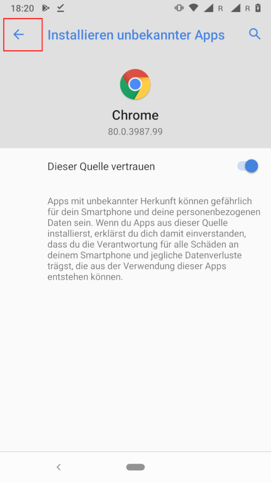

# F-Droid

**Warnung: Die Verwendung externer Paketquellen kann die Sicherheit deines Android Systems beeinträchtigen.** F-Droid ermöglicht es, unabhängig von Google, Apps auf deinem Smartphone zu installieren. Zum einen erhöht dies die Freiheit der Nutzenden, zum anderen verlangt es von diesen auch ein erhöhtes Sicherheitsbewusstsein. **Aus diesem Grund sei dieser Schritt nur Benutzer.innen empfohlen, welche sich in der Lage sehen, die Risiken zu verstehen und abwägen zu können.**

**_Die Urheber dieser Dokumentation übernehmen KEINE Verantwortung für Folgen, welche aus den Folgen dieser Anleitung noch dem Benutzen von F-Droid entstehen können._**

[F-Droid](https://www.f-droid.org/) ist ein alternativer App-Store für Android und ermöglicht es, unabhängig von kommerziellen Stores sein Gerät mit Apps und Updates zu versorgen.

Zunächst muss die Applikation aus dem Internet [herunter geladen werden](https://f-droid.org/F-Droid.apk). Hierfür kann der vorherige Link oder dieser QR-Code verwendet werden.

Sobald der Download der Applikation begonnen hat, bestätige, dass du die Datei auf deinem System behalten willst mit einem Tippen auf »Ok«.

Wen der Download abgeschlossen ist öffne die Datei mit einem Klick auf »Öffnen«.

Wenn du nicht bereits andere Applikationen über deinen Browser installiert hast, wird dir der folgende Dialog präsentiert. Klicke auf »Einstellungen«.

Aktiviere nun die Schaltfläche »Dieser Quelle vertrauen«.

Kehre nun mit einem Klick auf den Pfeil oben links zurück.

Dir sollte nun der folgende Dialog präsentiert werden. Ist dies nicht der Fall, so suche die F-Droid Datei in deinen Downloads und öffne sie erneut.

Klicke auf »Installieren«.

Sobald die Installation abgeschlossen ist, wirst du darüber informiert. Tippe auf »Öffnen« um F-Droid zu starten.

Du kannst nun Applikationen aus dem unabhängigen F-Droid Store herunterladen.

