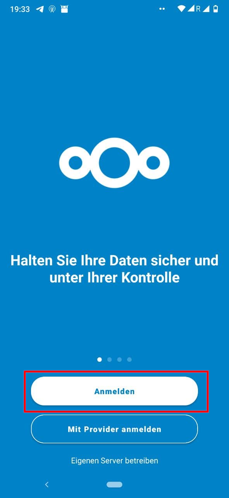
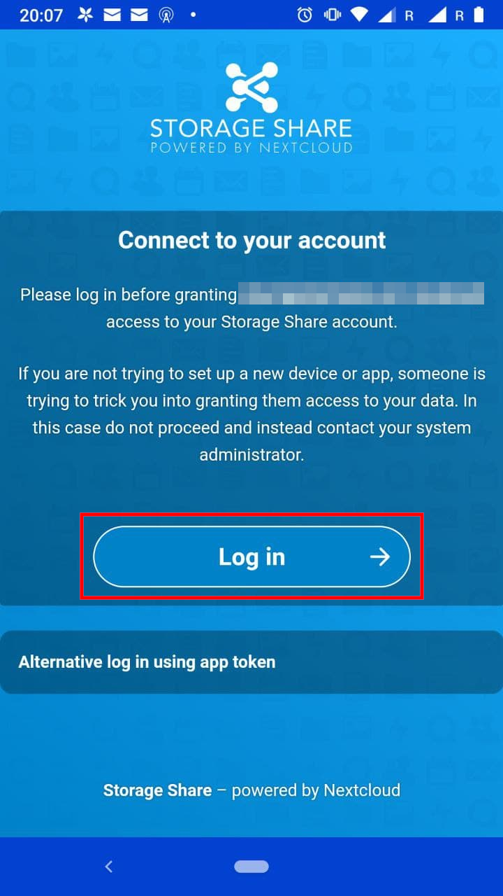
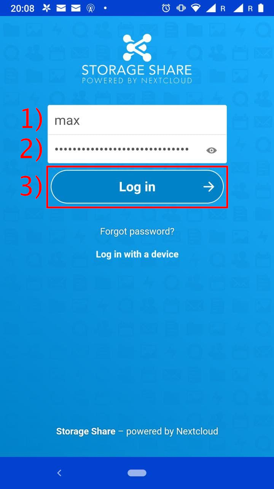
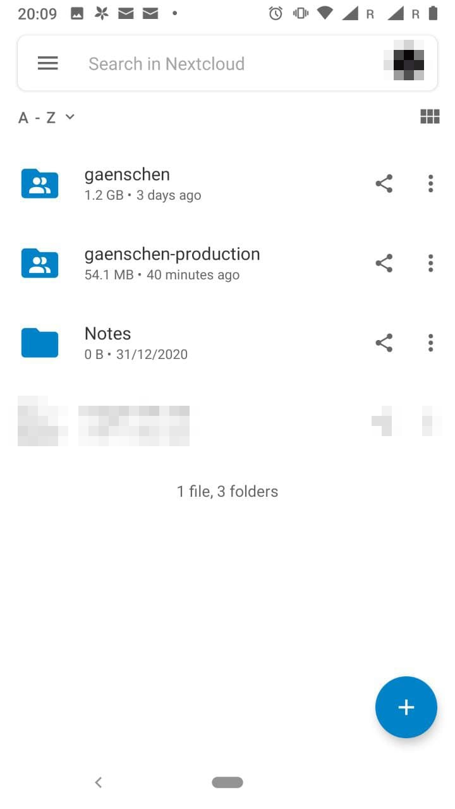

# Dateien

Wer die Dateien auf sein Smartphone synchronisieren möchte, muss zunächst die Nextcloud App [aus dem Playstore](https://play.google.com/store/apps/details?id=com.nextcloud.client) laden.

Sobald die Applikation installiert ist, öffne diese und tippe auf »anmelden«.

Nun muss die URL der Cloud (in unserem Falle `https://nx15150.your-storageshare.de`) eingegeben und die Eingabe mit einem Klick auf den Pfeil (2) bestätigt werden.

Es wird nun die Anmeldeseite der Cloud geladen. Fahre mit einem tippen auf »Anmelden« fort.

Nun den persönlichen Nutzername und das zugehörige Passwort eingeben. Danach die Eingabe mit einem Tippen auf »Anmelden« bestätigen.

Das Einrichten ist nun abgeschlossen und die App kann verwendet werden.

