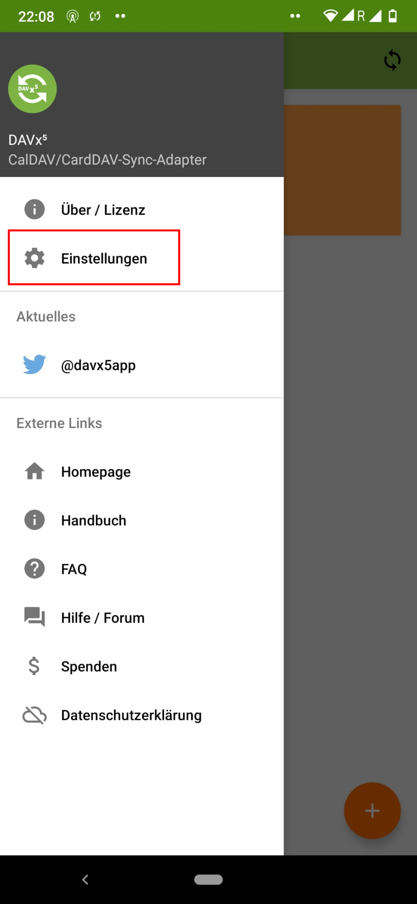
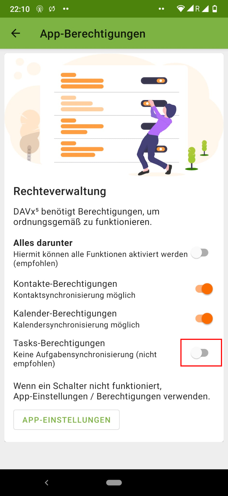

# Aufgaben

Die Aufgabenlisten (ToDo-Listen, Tasks) von Nextcloud sind an die jeweiligen Kalender geknüpft. In anderen Worten: Sobald ein Kalender mit dem Smartphone synchronisiert ist (siehe Abschnitt [Kalender und Kontakte](/clients/android/cal/index.html)), sind auch die entsprechenden Aufgabenlisten auf deinem System für ToDo-Apps verfügbar. Personen, welche noch nicht über solch eine App verfügen, sei [Tasks.org](https://play.google.com/store/apps/details?id=org.tasks) empfohlen. Diese unterstützt auch Dinge wie Sub-Tasks usw. Die folgende Anleitung zeigt, wie die Berechtigungen korrekt gesetzt werden können.

Die Einstellung muss in der DAVx5 App vorgenommen werden (also nicht in Tasks). Öffne also die App und klappe das Menü mit einem Klick auf die drei Striche oben links aus.

Öffne die Einstellungen mit einem Tippen darauf.

Scrolle runter, bis du die Schaltfläche »App-Berechtigungen« siehst. Wenn dies der Fall ist, tippe darauf.

Nun den Schieberegler neben »Tasks-Berechtigungen« aktivieren.

