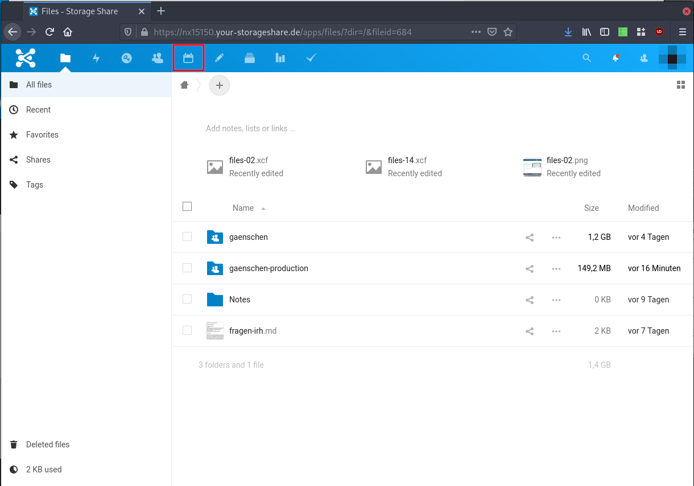
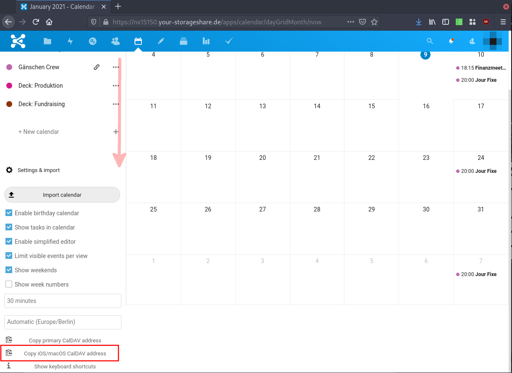

# URL für Kalender- und Kontaktsynchronisation

Gewisse Applikationen (z.B. die Kalenderapplikationen von Mac und Windows) benötigen eine spezielle URL, um auf die Daten zugreifen zu können. Da das Vorgehen für alle Systeme das selbe ist, wird dies hier für alle Systeme gemeinsam beschrieben. Diese Anleitung ist für dich nur von Interesse wenn du von einer anderen Dokumentation explizit hierauf verwiesen worden bist.

**TL;DR.** Die URL kann auch von deinem Benutzername (der Name mit welchem du dich auf Nextcloud einloggst) abgeleitet werden. Nimm `https://nx15150.your-storageshare.de/remote.php/dav/principals/users/BENUTZERNAME/` und ersetzte `BENUTZERNAME` mit deinem Nutzername (Beispiel, wenn dein Nutzername `max` ist, würde die URL `https://nx15150.your-storageshare.de/remote.php/dav/principals/users/max/` sein). Wenn dir das zu kompliziert ist, kannst du auch der weiteren Anleitung folgen.

Öffne zunächst die Cloud in deinem Webbrowser. Danach wechsle zur Kalenderansicht.

Klicke auf »Settings & Import«/»Einstellungen & Import«.

Scrolle nun nach unten, bis du »Copy iOS/macOS CalDAV address« siehst und klicke darauf. Die URL wurde nun in die Zwischenablage kopiert und kann verwendet werden.

