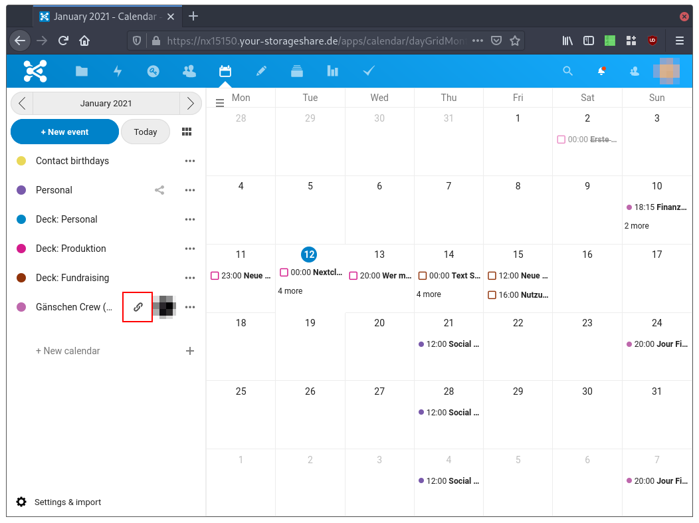
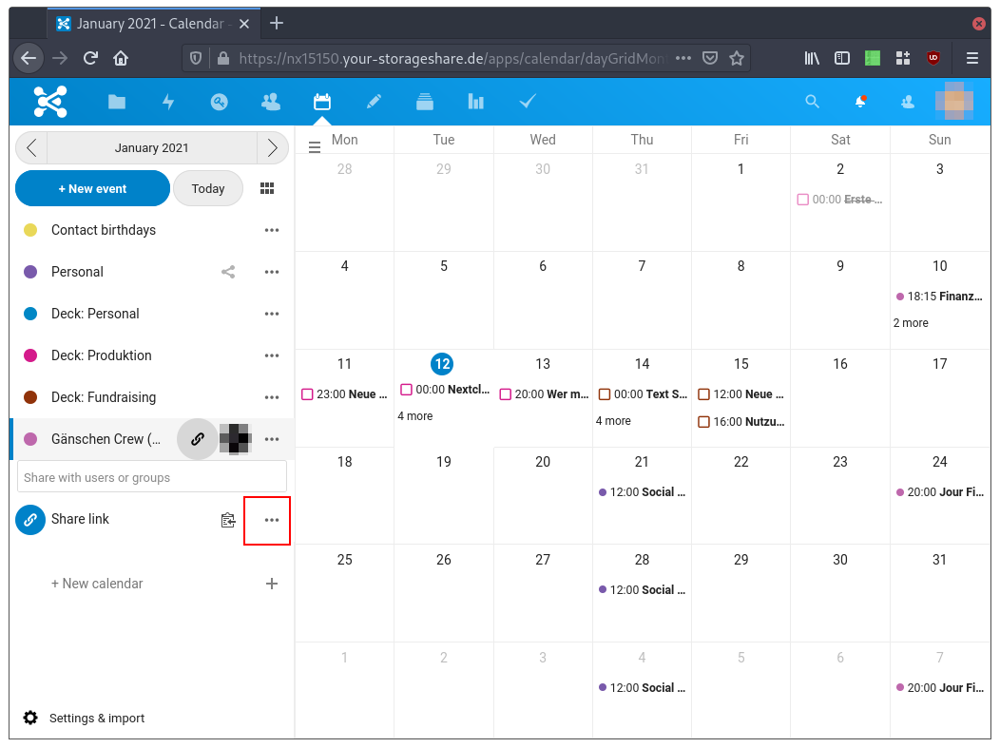
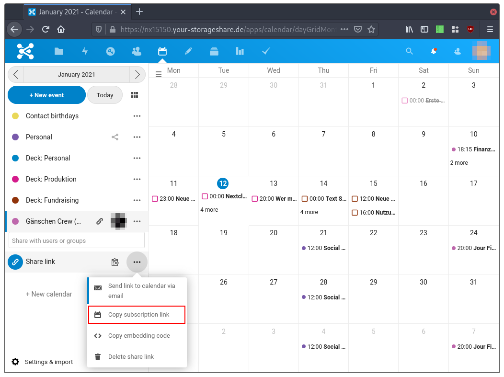
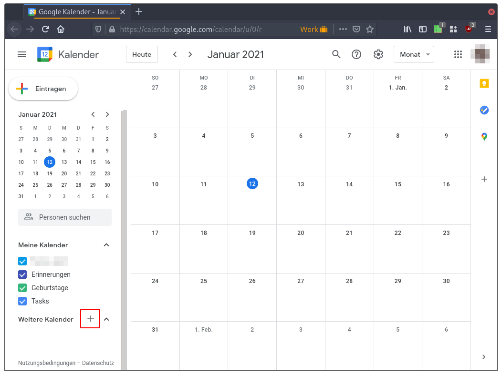

# Nextcloud Kalender in Google Kalender anzeigen (abonnieren)

Es ist möglich, einzelne Nextcloud Kalender in Google Kalender zu abonnieren. Es ist dann also möglich, den Inhalt des Kalenders in Google zu sehen aber nicht zu bearbeiten.

Öffne zunächst den Online Kalender der Nextcloud im Browser. Wähle den Kalender aus, welchen du in Google einbinden willst und klicke auf das Share Symbol (Kette) neben diesem.

Ein Menü klappt sich auf, klicke nun auf den Button mit den drei Punkten.

Klicke nun auf »Copy subscription link«. Die URL für den Kalender befindet sich nun in deiner Zwichenablage. 

Öffne nun Google Kalender und klicke auf das Plus neben »Weitere Kalender«.

In dem sich nun öffnenden Menü klicke auf »Per URL«.

Im Textfeld »URL des Kalenders« fügst du die URL aus der Zwischenablage ein (1). Danach kannst du die Eingabe mit einem Klick auf »Kalender hinzufügen« abschließen.

Der Inhalt des Kalenders wird nun in Google Kalender angezeigt.
