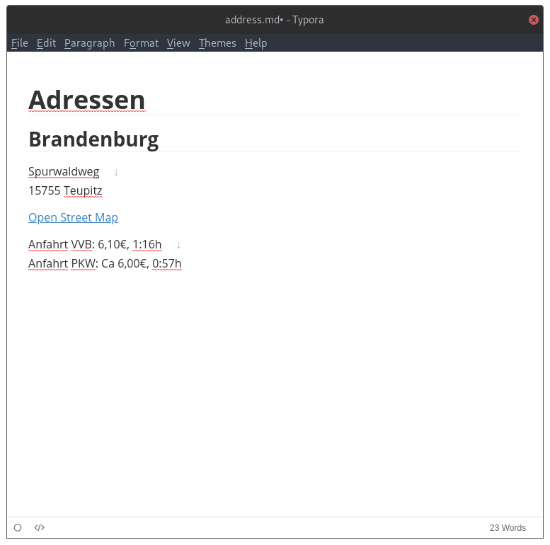

# Nextcloud Textdokumente lokal auf dem Computer bearbeiten (Markdown)

Die Textdokumente aus Nextcloud können auch lokal auf deinem Computer bearbeitet werden. Es handelt sich hierbei um sogenanntes [Markdown Dateien](https://de.wikipedia.org/wiki/Markdown#Auszeichnungsbeispiele). Es handelt sich um reine Textdateien, welche über eine einfache Syntax für die Formatierung verfügen. Grundsätzlich kannst du diese Dokumente einfach in einem Texteditor (beispielsweise Notepad auf Windows) öffnen.

Für alle Personen, welche etwas mehr Komfort wünschen, sei die Applikation [Typora](https://typora.io/) empfohlen, welche [hier](https://typora.io/#download) heruntergeladen werden kann. Typora bietet nicht nur eine ähnliche Oberfläche wie Nextcloud, sondern erlaubt es auch Dokumente formatiert zu drucken oder als _PDF, Worddatei etc. zu exportieren._

## Markdown als PDF speichern

Mit Typora können die Dokumente auch als PDF, Word, etc. gespeichert werden. Öffne hierfür die Datei in Typora und klicke auf `File > Export`/`Datei > Exportieren` und wähle danach das gewünschte Format.

