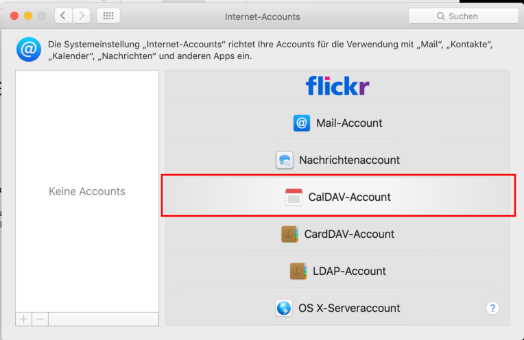

# Mac Kalender einrichten

Die Kalender Applikation von macOS kann mit Nextcloud verbunden werden.

Öffne hierzu zunächst die Kalenderapp auf deinem Mac. Danach klicke in der Menüleiste auf »Kalender« (1) und danach auf »Accounts...« (2).

Dies öffnet die Accounteinstellungen des Kalenders. Wenn du bereits über Accounts verfügst (der Dialog also nicht so wie unten aussieht) klicke zunächst auf das Plus links unten (1). Danach klicke auf »Anderen Account hinzufügen« (2). Wenn du noch über keinen Account verfügst, kannst du den ersten Schritt überspringen und gleich auf »Anderen Account hinzufügen« klicken.

Wähle als Typ »CalDAV-Account« aus.

Im nächsten Dialog müssen die korrekten Einstellungen gesetzt werden. Wähle zunächst (1) als Accounttyp `Manuell` aus. Danach kannst du die Einstellungen (2) wie folgt setzten:

| Einstellung   | Was                                                | Beispiel                       |
|---------------|----------------------------------------------------|--------------------------------|
| Benutzername  | Dein Loginname für Nextcloud.                      | `max`                          |
| Passwort      | Das Passwort, welches du für Nextcloud verwendest. |                                |
| Serveradresse | Die URL der Nextcloud.    | `https://nx15150.your-storageshare.de` |

Die Eingabe mit einem Klick auf »Anmelden« abschließen.

Erlaube den Zugriff mit einem Klick auf »Immer erlauben«.

Die neue Kalenderverbindung befindet sich nun bei deinen Kalenderaccounts. In der Kontenübersicht aktiviere nun den neuen Eintrag (1). Je nach verwendeter URL kann der Kontonamen etwas lang werden, dies kannst du im Feld »Beschreibung« (2) ändern, der neue Name findet sich dann auch entsprechend in der Kalender Applikation.  Wenn du die Aufgabenlisten (ToDo's) in die Erinnerungen App integrieren möchtest, aktiviere das entsprechend (3).

Du kannst nun auf alle Kalender von der Nextcloud zugreifen. Es kann sein, dass du diese zunächst nicht siehst. Um dies zu ändern, Klicke in der Hauptansicht von Kalender auf »Kalender« und aktiviere die gewünschten Kalender.

