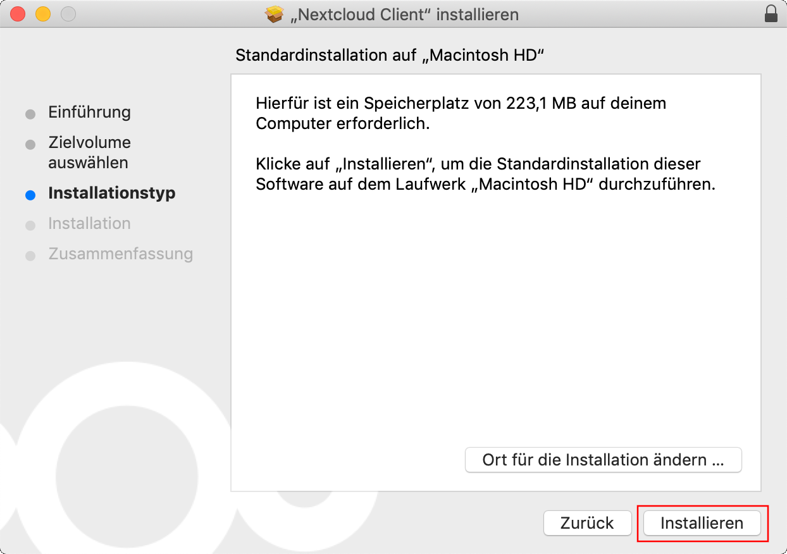
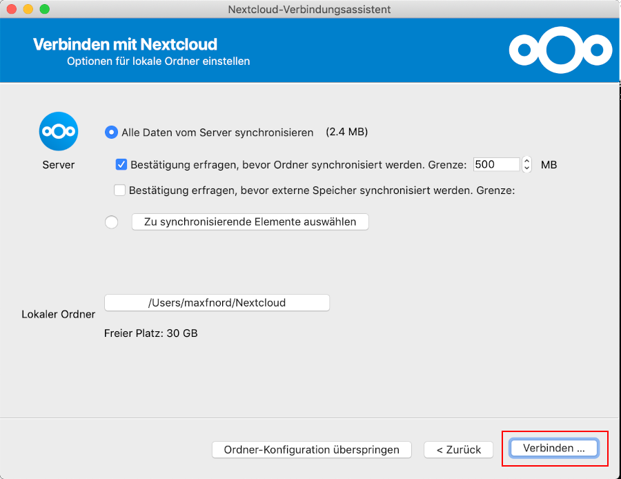

# Dateien

Diese Anleitung hilft dir, die Dateien von Nextcloud mit deinem Mac zu synchronisieren.

## Installation Client

Zunächst muss der Client heruntergeladen werden. Gehe hierfür auf [https://nextcloud.com/install/#install-clients](https://nextcloud.com/install/#install-clients) und klicke auf »macOS« um den Installer herunterzuladen.

 

Sobald die Datei fertig heruntergeladen ist, klicke auf den Download-Button (1) und öffne den Nextcloud-Installer (2).

 

Klicke auf »Fortfahren«.

 

Klicke auf dein System-Volumen (1) und fahre mit einem Klick auf »Fortfahren« (2) fort.

 

Starte die Installation mit einem Klick auf »Installieren«.

 

Erlaube den Zugriff auf Finder mit einem Klick auf »Ok«.

 

Nachdem die Installation abgeschlossen ist, schließe den Installer mit einem Klick auf »SChließen«.

 

Lösche den Installer mit einem Klick auf »In den Papierkorb legen«.

 

## Account hinzufügen

Sobald die Installation abgeschlossen ist, kannst du dein Nexctloud-Account konfigurieren. Öffne hierzu zunächst das Programm Nextcloud. Öffne hierzu den Finder und wechsle in den »Programme« Ordner.

 

Öffne Nextcloud mit einem Doppelklick auf »Nextcloud«.

 

Es öffnet sich ein Assistent. Klicke auf »Bei Nextcloud anmelden«.

 

Gib nun im Feld »Serveradresse« die URL der Cloud ein (1). Es handelt sich hierbei um die Adresse, welche du auch verwendest um die Cloud in deinem Browser zu öffnen (in unserem Fall `https://nx15150.your-storageshare.de`). Bestätige die Eingabe mit einem Klick auf »Weiter« (2).

 

Es öffnet sich nach kurzer Zeit ein Browserfenster, in welchem du auf »Anmelden« klickst.

 

Gib nun dein Benutzername (1) sowie Passwort (2) ein und melde dich mit einem Klick auf »Anmelden« an (3).

 

Erlaube den Zugriff mit einem Klick auf »Zugriff erlauben«/»Grant access«.

 

Das Browserfenster kann nun geschlossen werden. Nach einer kurzen Wartezeit wird dir der Nextcloud-Assisten den nächsten Dialog anzeigen. Deaktiviere in diesem die Option »Bestätigung erfragen, bevor externe Speicher synchronisiert werden.«

 

Schließe die Eingabe mit einem Klick auf »Verbinden« ab.

 

Die Nextcloud ist nun fertig konfiguriert. In deiner Menüleiste hast du nun ein neues Symbol. In diesem erhältst du in Zukunft Benachrichtigungen und kannst auch den Nextcloud-Ordner auf deinem Mac öffnen.

 

