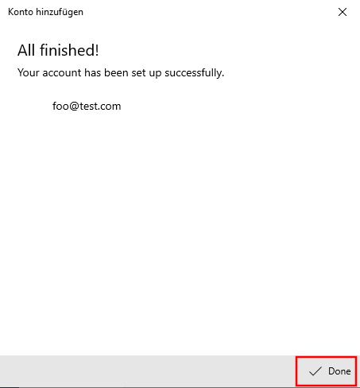

# Windows 10 Kalender einrichten

Die Kalenderapplikation von Windows 10 kann mit Nextcloud verbunden werden.

Als erster Schritt öffne die Kalenderapplikation auf deinem System. Danach öffne die Einstellungen mit einem Klick auf das Zahnradsymbol links unten.

In den Einstellungen »Manage Accounts«/»Konten verwalten« auswählen.

In der Kontenübersicht mit einem Klick auf »Add account«/»Konto hinzufügen« ein neues Konto anlegen.

Im Dialog die Option »iCloud« auswählen.

Im nächsten Dialog müssen die drei Textfelder ausgefüllt werden (1 bis 3). _Die hierbei eingegebenen Daten müssen nicht korrekt sein._  Es reicht also, irgendwelche Werte zu verwenden.

Nach einer kurzen Wartezeit ist das Konto angelegt und der Dialog kann geschlossen werden.

In der »Konten verwalten« Übersicht klicke auf das soeben angelegte Konto.

Im neu geöffneten Dialog auf »Synchronisationseinstellungen für Postfach ändern« klicken.

In dieser Ansicht nach unten scrollen und auf »Erweiterte Postfacheinstellungen« klicken.

Ein weiterer Dialog wird geöffnet. Scrolle runter, bis du die Textfelder »Kontaktserver (CardDAV)« und »Kalenderserver (CalDAV)« sehen kannst. In diese beide Felder muss die Kalendersync URL eingegeben werden. Wie diese gefunden werden kann, erklärt [dieser Artikel](/clients/general/cal-url/index.html). Danach die Eingabe mit einem Klick auf »Fertig« beenden.

Schliesse danach auch den Synchronisationseinstellung Dialog und gib nun deinen korrekten Benutzername (1), Kennwort (2) und Mailadresse (3, die Adresse, welche sich in deinem Nextcloud-Account findet). Schliesse deine Eingaben mit einem Klick auf »Speichern« ab.

Du kannst nun den Kalender von Nextcloud auf Windows 10 nutzen.

