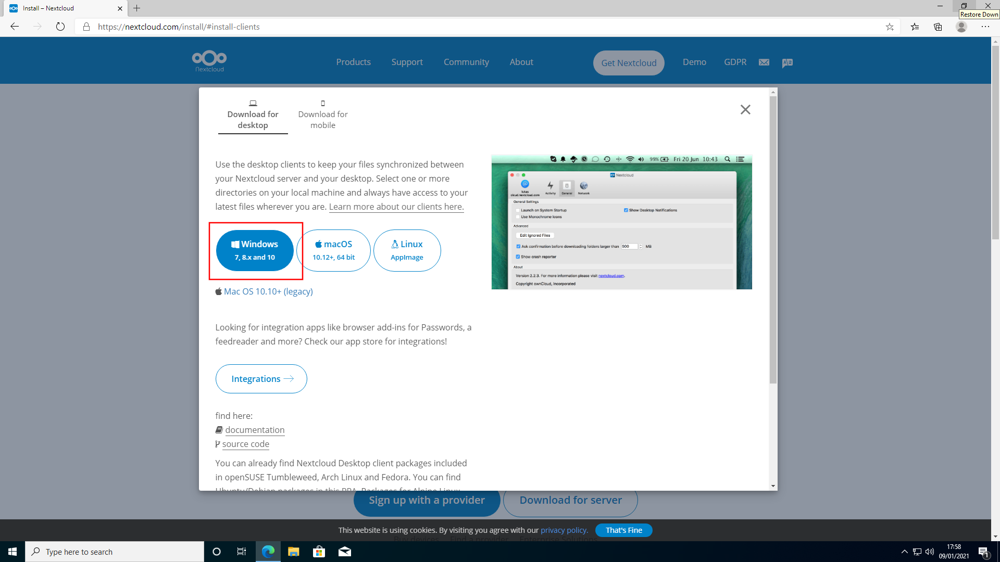
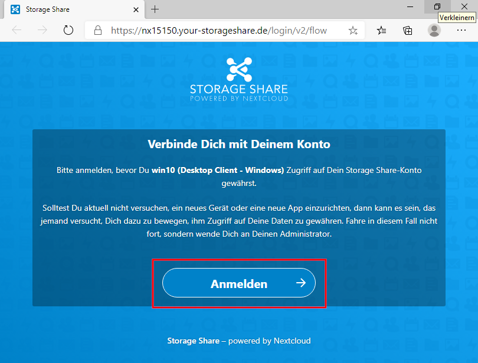

# Dateien

Diese Anleitung hilft dir, die Daten von Nextcloud mit deinem Windowssystem zu synchronisieren.

## Installation Client

Zunächst muss der Client heruntergeladen werden. Gehe hierfür auf [https://nextcloud.com/install/#install-clients](https://nextcloud.com/install/#install-clients) und klicke auf »Windows« um den Installer herunterzuladen.

Wenn der Download abgeschlossen ist, öffne die heruntergeladene Datei mit einem Klick auf die Datei.

Der Installer öffnet sich. Klicke auf »Next« um die Installation zu starten.

Klicke auf »Next«.

Starte die Installation mit einem Klick auf »Install«.

Erlaube das Durchführen der Installation mit einem Klick auf »Ja«.

Warte bis die Installation abgeschlossen ist und schliesse den Installer mit einem Klick »Finish«.

## Account hinzufügen

Starte das Nextcloud Programm auf deinem Computer. Der unten dargestellte Dialog wird sich öffnen. Klicke auf den oberen linken Bereich der Titelleiste (innerhalb des rot markierten Bereichs).

Klicke auf »Konto hinzufügen«.

Ein Assistent öffnet sich. Klicke auf »Bei Nextcloud anmelden«. (Hinweis: Sollte sich nicht der nächste Dialog öffnen, sondern eine Website, gehe zurück und betätige den »Bei Nextcloud anmelden« erneut.)

Nun muss die URL der Cloud (in unserem Falle `https://nx15150.your-storageshare.de`) eingegeben und die Eingabe mit einem Klick auf »Weiter« (2) bestätigt werden.

Es wird sich nun ein Browserfenster öffnen. Wenn das der Fall ist, klicke auf »Anmelden«.

Gib dein Benutzername (1) und Passwort (2) ein und fahre mit einem Klick auf »Anmelden« (3) fort.

Erlaube dem Desktopprogramm den Zugriff mit einem Klick auf »Grant access«/»Zugriff erlauben«.

Das Browserfenster kann nun geschlossen werden.

Kehre nun zum Assistenten zurück und warte, bis du die unten abgebildete Ansicht sehen kannst. Deaktiviere die Option »Bestätigung erfragen, bevor externe Speicher synchronisiert werden«.

Klicke nun auf »Verbinden«.

Das Einrichten ist nun abgeschlossen. Auf die Daten kann nun im Explorer zugegriffen werden. Nutze einfach das neue Bookmark »Nextcloud«.

