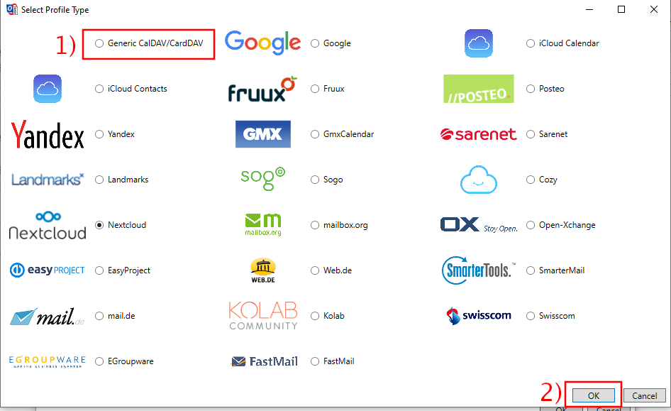
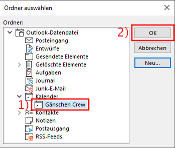
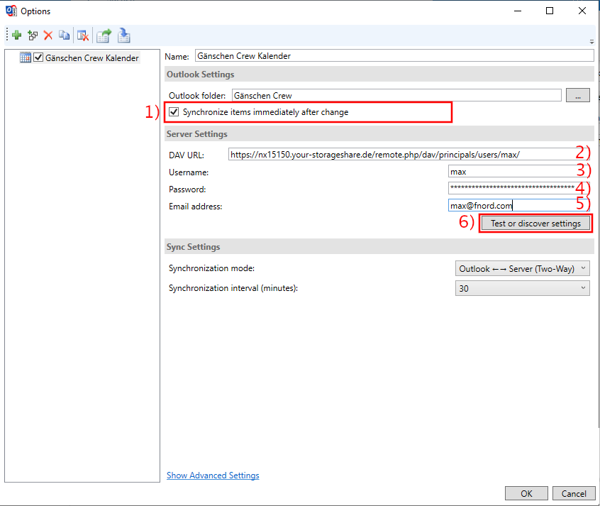
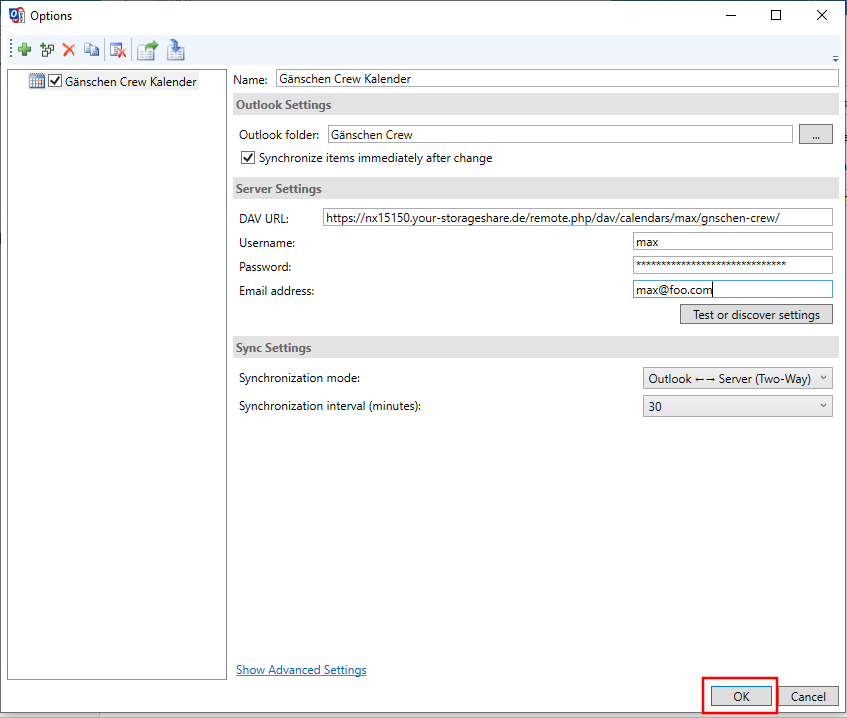

# Outlook (Kontakte, Termine und Aufgaben) synchronisieren

Dieser Abschnitt beschäftigt sich mit dem Einrichten von Nextcloud mit Outlook. Hierfür ist ein Plugin erforderlich, dessen Installation und Konfiguration nun erklärt wird.

## Plugin installieren

Für die Integration wird das Plugin [Outlook CalDav Synchronizer](https://caldavsynchronizer.org/) benötigt. Gehe zunächst auf [diese Seite](https://caldavsynchronizer.org/download-2/) und klicke auf »Download« um das Herunterladen zu starten.

Wenn der Download abgeschlossen ist, klicke auf die heruntergeladene Datei um sie zu öffnen.

Ein Dateifenster öffne sich. Starte die Installation mit einem Doppelklick auf die Datei »CalDavSynchronizer Setup«.

Klicke auf »Next«.

Klicke auf »Next«.

Erlaube das Durchführen der Installation mit einem Klick auf »Ja«.

Warte, bis die Installation abgeschlossen ist und beende sie mit einem Klick auf »Close«.

## Konfiguration

Öffne nun Outlook. _Achtung:_ Wenn Outlook während der Installation des CalDavSynchronizer offen war, musst du Outlook schliessen und nochmals öffnen.

Outlook verfügt nun über eine neue Registerkarte (»CalDav Synchronizer«). Öffne diese, indem du auf diese  klickst.

Klicke nun auf »Synchronization Profiles«.

Lege ein neues Profil mit einem Klick auf das grüne Plus an.

Wähle die »Generic CalDAV/CardDAV« Option aus (1) und bestätige diese Wahl mit einem Klick auf »Ok«.

Das Profil kann nun weiter editiert werden. Gibt zunächst (1) dem Profil einen Namen. Dieser hat keine weitere Funktion, hilft aber bei der Unterscheidung mehrerer Profile. Es empfiehlt sich einfach den Namen des Kontaktbuches oder Kalenders zu verwenden, welcher synchronisiert werden soll.

Aufgrund des Aufbaus von Outlook, muss jedes Kontaktbuch/Kalender/Aufgabenliste _separat_ in einem eigenen Profil angelegt werden. Der Abschnitt »Konfiguration« muss also für alle Kontaktbücher/Kalender/Aufgabenlisten einzeln wiederholt werden. In Folge wird das Vorgehen anhand eines Kalenders gezeigt. Die Schritte für Kontaktbücher oder Aufgabenlisten sind aber die selben, auf Unterschiede wird hingewiesen werden.

Klicke auf den »...« Button.

Klicke auf »Neu«.

Es muss nun ein neuer Ordner für den Kalender/Kontaktbuch/Aufgabenliste (ab jetzt »Ressource« genannt) angelegt werden. Vergebe hierzu zunächst (1) einen Namen. Dieser kann frei gewählt werden, am besten benennst du ihn so, wie die Ressource in der Nextcloud heisst. In einem zweiten Schritt (2) musst du den Elemententyp auswählen. Dieser entspricht der Ressource. In anderen Worten: Wenn du einen Kalender synchronisieren möchtest, brauchst du einen »Kalender« Typ etc.

Abschliessend (3) musst du den Speicherort wählen. Aktiviere hierzu den passenden Ort. Wenn du eine Aufgabenliste synchronisieren möchtest wähle »Aufgaben« (A), für Kalender »Kalender« (B) und für Kontakte »Kontakte« (C). Schliesse deine Eingaben mit einem Klick auf »Ok« (4) ab.

Wähle den soeben angelegten Kalender/Kontaktbuch/Aufgabenliste aus (1) und bestätige deine Wahl mit »Ok« (2).

Aktiviere zunächst (1) die Option »Synchronize items immediately after change« und gib danach die Kalender-URL ein (2), wie du diese herausfindest erfährst du [hier](/clients/general/cal-url/index.html). Weiter gibst du dein Benutzername (3) sowie Passwort (4) ein. Abschliessend gib deine Mailadresse, welche auch von deinem Nextcloud-Account verwendet wird ein (5).

Klicke nun auf »Test or discover settings«.

Es öffnet sich nun ein weiterer Dialog, indem du aus den vorhandenen Kalender/Kontaktbücher/Aufgabenlisten auswählen kannst. Klicke auf die gewünschte Ressource (1) und bestätige die Auswahl mit »Ok« (2).

Die Konfiguration ist nun abgeschlossen. Mit einem Klick auf »Ok« werden deine Einstellungen gespeichert und du kannst die neue Ressource nutzen.

_Hinweis:_ Vergiss nicht, für jeden weiteren Kalender/Kontaktbuch/Aufgabenliste ein neues Profil und einen neuen Ordner anzulegen.

