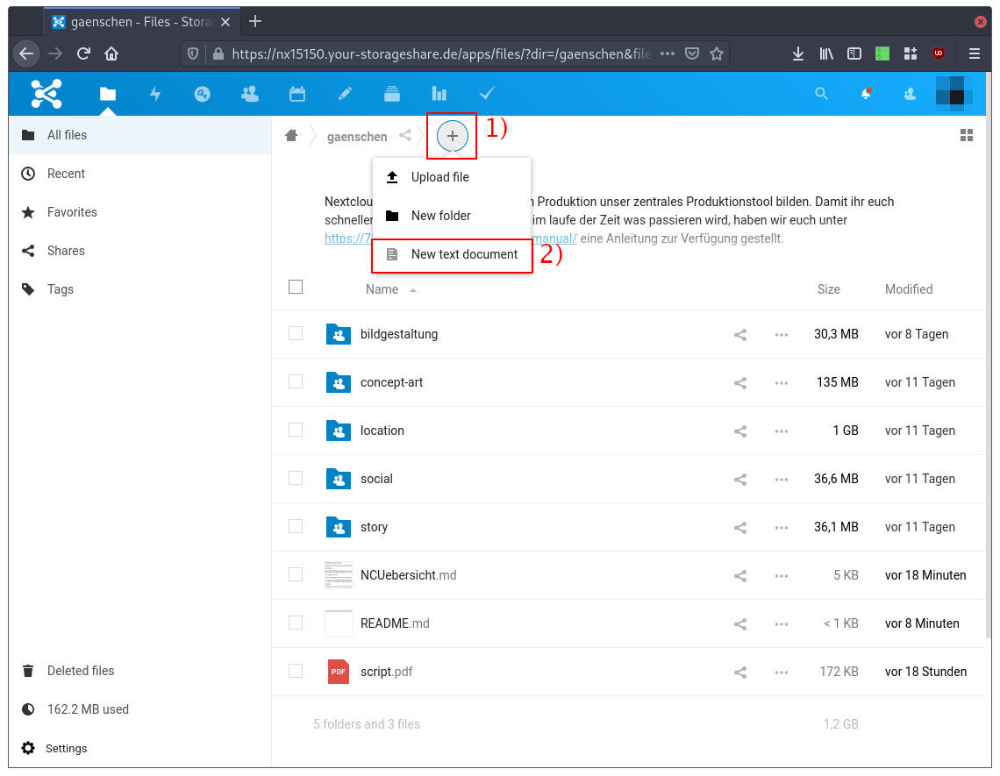
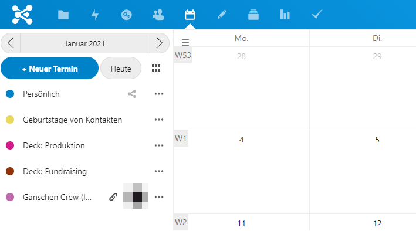
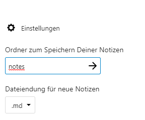
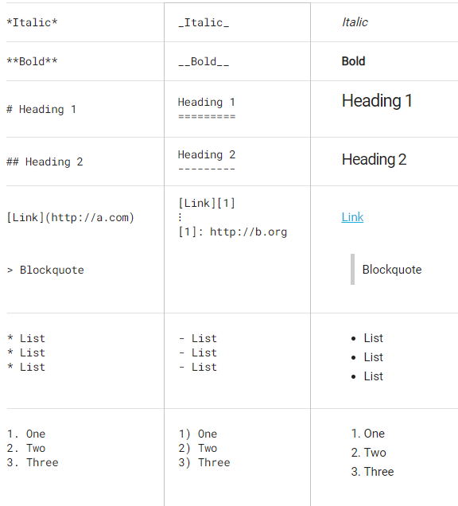
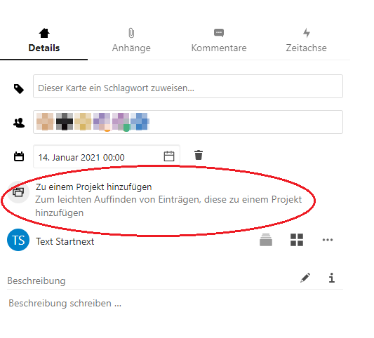

# Arbeiten in der Cloud

Nextcloud wird während der gesamten Produktion unser zentrales Produktionstool bilden. Damit ihr euch schneller zurecht findet und wisst, wo im laufe der Zeit was passieren wird; hier eine kleine Übersicht.

## Einstellungen

Über euer Profilbild rechts oben könnt ihr auf die Nextcloud Einstellungen zugreifen.

Hier findet ihr vor allem die Möglichkeit eure Sprache zu ändern unter den **Persönliche Information** Punkt und habt auch Zugriff auf gewisse **Barrierefreiheiten**. 

## Gruppen und User

Die Berechtigungen werden nach Gruppen verteilt. Die Gruppen richten sich grundsätzlich nach den Gewerken, der Head hat jeweils Administrationsrechte für seine Gruppe. Wer zusätzliche User oder Gruppenzugehörigkeiten braucht, kann sich bei der Produktion melden.

* **Crew.** Alle, welche an diesem Projekt mitarbeiten und Zugriff auf den Hauptordner (`gaenschen`, also diesen) erhalten sollen.
* **Heads.** Die jeweiligen Heads der Gewerke. Sie erhalten zusätzlich Zugriff auf das Crew-Adressbuch.

## Daten

**Allgemein.** Ihr könnt gerne diese Cloud nutzen, um projektbezogen Daten zu speichern. Da wir auf auf dieser Instanz momentan aber nur **100 GB** zur Verfügung haben, kann jeder User maximal 5 GB Daten nutzen. Wer mehr braucht, meldet sich bitte bei Irvin. Für Personen, welche intensiver mit den Dateien arbeiten, empfielt sich eventuell den Download des Desktop-/Mobileclient. Der Client funktioniert ähnlich wie der von Dropbox (einfach in stabil). Ausführliche Informationen über die Installation findet ihr in dem entsprechenden Abschnitt dieser Dokumentation ([Android](/clients/android/files/index.html), [Mac](/clients/mac/files/index.html), [Windows](/clients/windows/files/index.html))

**Daten.** Für einfache Textdokumente verwendet bitte die Notizapp (also Textfiles mit einer `.md` Endung). Die sind für alle Beteiligten auch ohne zusätzliches Programm lesbar, weitere Informationen hierzu findest du im nächsten Abschnitt.

Bitte verzichtet auf `.pages` und `.numbers` Dokumente von Apple Office. Wenn es Pages sein muss, ladet bitte jeweils auch eine PDF hoch.

## Textdokumente

Um ein Textdokument anzulegen, navigiere dich in den gewünschten Ordner und klicke auf den Plus Button (1) und danach auf »New Text Document« (2).

Solche Dokumente können auch von mehreren Personen gleichzeitig bearbeitet oder betrachtet werden.

Die Dokument können mit zusätzlichen Programmen auch als PDF oder Word Datei exportiert werden. Weitere Informationen finden sich [in diesem Abschnitt](/clients/general/markdown/index.html).

## Sensible Daten (Passwörter etc.)

Sobald multiple Accounts angelegt sind, die auch von mehreren Menschen verwaltet werden sollen, wird hier eine Passwortdatenbank für die entsprechenden Personen vorliegen. 

Aktuell noch ausstehend.

## Kalender

Auf der linken Seite des Kalenders findet ihr alle mit euch geteilten Kalender. Hierbei gibt es vor allem zwei unterschiedliche Arten, die für euch relevant sind:

Alle mit `Deck:` davor sind automatisch generierte Einträge aus dem Projektmanagement, weshalb sie **read-only** sind - also nicht editierbar - und leiten euch weiter zur entsprechenden Aufgabe (dazu unten mehr).

Die anderen Kalender die mit euch **von Personen geteilt** wurden (i.d.R. von Irvin oder Philip), sind in der Regel wichtige Termine für die entsprechenden Departments.

## Notizen

Schnelles erfassen von Notizen in `.txt` oder als Markdown `.md`.

Um Speicherort und Dateiformat zu ändern ist unten links ein Zahnrad für Einstellungen.

Hier kann der Ordner des Speicherorts genannt werden. (Groß-/Kleinschreibung ist relevant!)

Zur schnellen Gestaltung kann auf die Markdown formatierung zurückgegriffen werden.

Hier ein kurzes Reference-Sheet:

## Deck (Projektmanagement)

Decks ist unsere zentrale Aufgabenverteilung in Nextcloud.

Zu Beginn seht ihr eine Übersicht an allen Aufgaben, die euch zugewiesen wurden und eine grobe zeitliche Einordnung. Wird hier nichts gezeigt, wurde noch keine Aufgabe mit euch verlinkt.

Alle Departments besitzen ein eigenes Deck und werden auf der linken Seite aufgelistet.

Pro Deck gibt es drei Listen, die den aktuellen Stand der Dinge darstellen - diese können per drag 'n drop verschoben werden.

* **Backlog.** Alle Aufgaben, deren Bearbeitung noch nicht begonnen ist.
* **In Progress.** Die Aufgabe befindet sich gerade in Bearbeitung.
* **Done.** Die Aufgabe ist erledigt.

Jede Aufgabe wird als eine Karte repräsentiert, welche durch diese drei Listen vom »Backlog« über »In Progress« zu »Done« durchwandert. Die Aufgaben können (und sollen) mit den/der zuständigen Person/-en verknüpft und mit einer Deadline versehen werden. Wenn ihr eine weitere Verfeinerung der Organisation wünscht, könnt ihr die Aufgaben zusätzlich mit Tags (aka. Schlagwörter) versehen. Die Aufgaben können danach entsprechend nach diesen Kategorien gefiltert werden.

Jede Karte kann außerdem kommentiert und mit Anhänge versehen werden.

Um eine Aufgabe mit einer anderen Karte, einem Board oder einer Datei in der Cloud zu verknüpfen, wählt ihr "zu einem Project hinzufügen" 

## Aufgaben / Tasks

Der Aufgabenreiter ist nochmal eine andere Ansichtsform der bestehenden Aufgaben und ist genauso wie die Decks Kalendereinträge **read-only!** (und werden genauso automatisch aus den Decks generiert)

 
